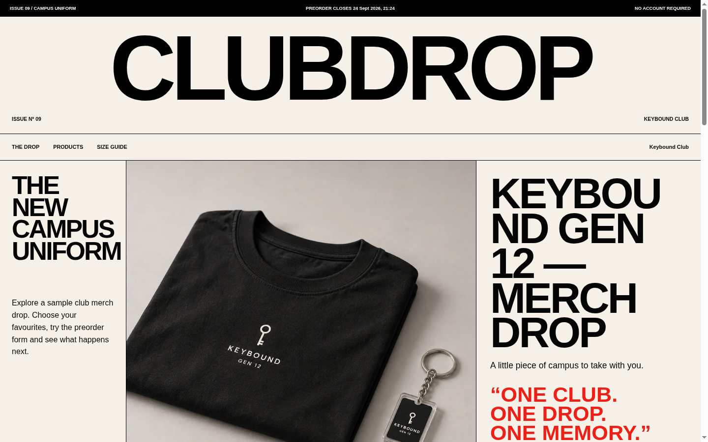
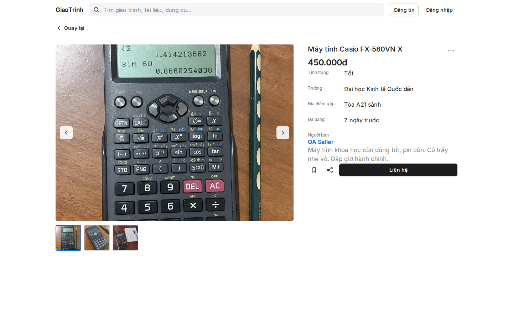
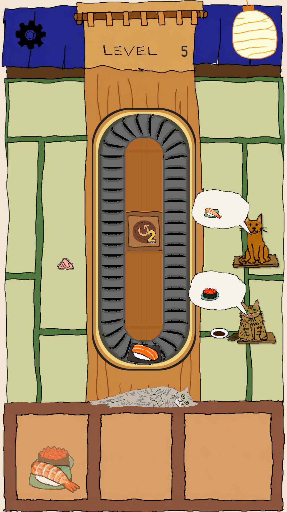

# Duy Lam — selected work

Campus products with hard constraints, plus a portrait Unity puzzle with hand-drawn runtime art. Three short case studies — private source stays private.

## Featured

| Project | Focus | Remember this |
| --- | --- | --- |
| **[Clubdrop](./clubdrop/case-study.md)** | Full-stack · AI-assisted | Constrained AI drafts club merch campaigns; organizer reviews then publishes; buyers preorder with no account. |
| **[GiaoTrinh](./giaotrinh/case-study.md)** | Full-stack · privacy | Vietnam campus exchange — browse anonymously; contact only after an explicit safety step. |
| **[SushiLoop](./sushiloop/case-study.md)** | Unity · game | Hand-drawn portrait sushi-routing puzzle; 20 levels, deterministic loop, structured AI workflow. |

### Preview

Clubdrop Issue · GiaoTrinh listing · SushiLoop Level 5

## Open source

- [drizzle-doctor](https://github.com/Duylamneuuu/drizzle-doctor) — Drizzle/PostgreSQL migration-history auditing
- [clisemver](https://github.com/Duylamneuuu/clisemver) — semantic-version compatibility checks for CLIs

## About this repo

Presentation only — screenshots + case studies. No app source, secrets, or user data. Curation rules: [CURATION.md](./CURATION.md).
