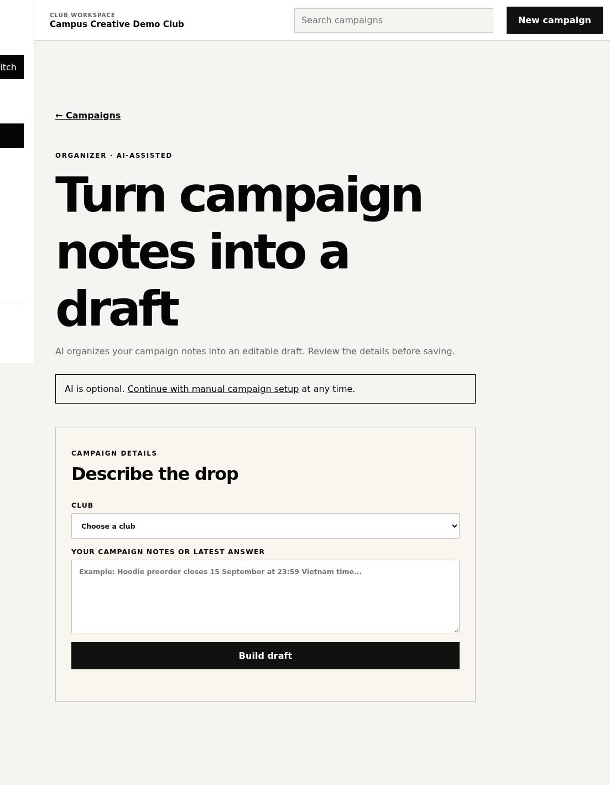
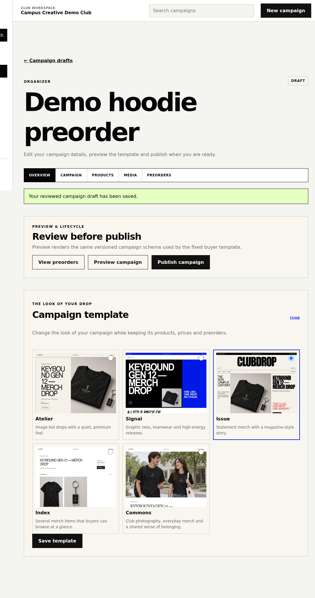

# Clubdrop

**In one line:** AI-assisted merch preorder campaigns for student clubs — AI drafts, organizer decides, buyers get a polished page with no account.

## The decision that matters

AI is allowed to **structure** messy club notes into a draft. It is **not** allowed to publish price, deadline, payment, or pickup without a human review. Public buyer pages are **zero-LLM** and use **five fixed templates** (not generated websites).

## Problem

Clubs still run drops through a chat post + Google Form + spreadsheet + DMs. Discovery is messy, details go stale, and there is no clean public page for buyers.

## What I built

- Canonical campaign model + five fixed templates
- Organizer workspace: AI or manual setup, required review, preview/publish, preorder roster
- Buyer link: preorder without an account
- Constrained AI draft → required organizer review → publish
- Deterministic buyer/organizer flows on structured data

## Flow

`messy notes → AI structure → required human review → publish → buyer preorder → roster`

## Stack

React Router · React · TypeScript · Cloudflare Workers · Supabase · Zod · Dify · Vitest · Playwright

## Status

Demo-ready on a development Worker. Closed-beta prep in progress. **Not** a production launch or traction claim.

## Screenshots

Live `clubdrop-dev` Worker. Synthetic Keybound Club / Campus Creative Demo Club data.

### Buyer — fixed templates

| Issue (hero) | Commons |
| --- | --- |
| Magazine layout, product photo, deadline, no-account CTA | Lifestyle lookbook |
|  |  |
| **Atelier** — quiet premium split | **Signal** — high-contrast poster |
|  |  |

### Organizer — AI drafts, human decides

1. **AI setup** — paste campaign notes; AI is optional; manual setup always available  
2. **Review / publish** — organizer keeps template, price, and publish control after a reviewed draft  
3. **Roster** — synthetic buyer preorder after publish (demo data only)
