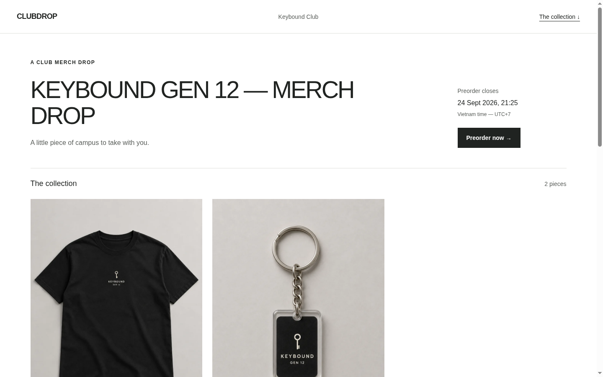

# Clubdrop

**AI-assisted merch preorder campaign builder for student clubs.**

Clubdrop replaces the familiar campus workflow of a social post, a Google Form, a spreadsheet, and repeated DMs with a cleaner campaign flow: organizers describe a drop, review structured details, publish a polished page, and manage incoming preorders from one workspace.

## What I built

The product uses a canonical campaign model and five fixed visual templates instead of generating websites from scratch. Buyers can open a shared campaign link and submit a preorder without creating an account. Organizers get a protected workspace for campaign setup, preview/publish controls, and preorder management.

The AI layer is deliberately constrained. It helps structure messy organizer notes into a candidate draft, but the organizer must review authoritative details such as price, deadline, payment instructions, and pickup information before saving. Public buyer pages do not depend on an LLM.

## Why I built it this way

The goal was not to recreate a full e-commerce platform. Student clubs usually need a lightweight campaign tool for occasional drops, not inventory, shipping, marketplace discovery, or platform-held payments. Fixed templates keep the output polished and predictable while the structured data model keeps buyer and organizer flows deterministic.

## Stack

React Router, React, TypeScript, Cloudflare Workers, Supabase, Zod, Dify, Vitest, and Playwright.

## Current status

Demo-ready on a development Worker. Product polish is complete and closed-beta preparation is in progress. This is not presented as a production launch or traction claim.

## Portfolio notes

The strongest story is the full workflow:

**messy organizer input → AI-assisted structuring → required human review → polished campaign page → organized preorder roster**

## Screenshots

Captured from the live development Worker (`clubdrop-dev`). Buyer frames are public template demos. The AI-review frame uses a synthetic club only; no real buyer PII. These are development/demo frames, not a production-launch or traction claim.

### Hero — Issue template (buyer page)

Editorial magazine layout: masthead, product photography, deadline, and no-account CTA. Served from structured campaign data with zero LLM on the buyer route.

### Template range — Commons

Lifestyle lookbook direction; proves templates are distinct, not skins.

### Template range — Atelier

Quiet premium split: typography + product flat-lay.

### Template range — Signal

High-contrast poster energy for campus drops.

### Template range — Index

Product-grid collection page with preorder CTA.

### Supporting — required human review

After one AI structuring pass, the organizer must confirm price, deadline, payment, pickup, and confirmation before creating a reviewed draft. This is the constrained-AI story, not a buyer-facing hero.

