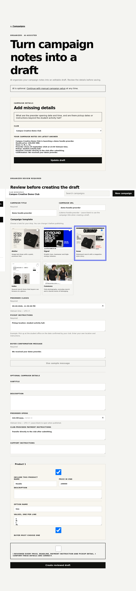
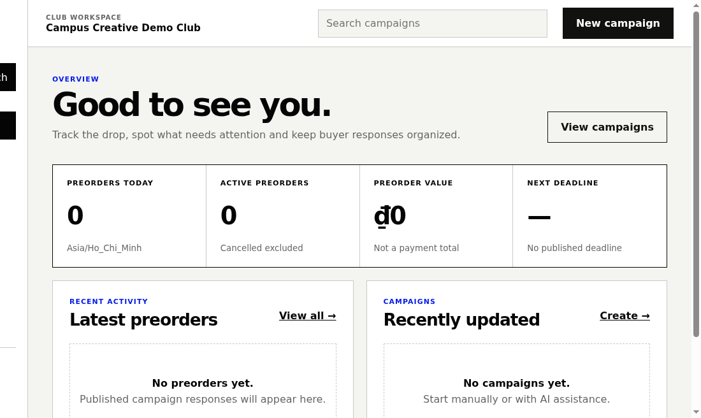
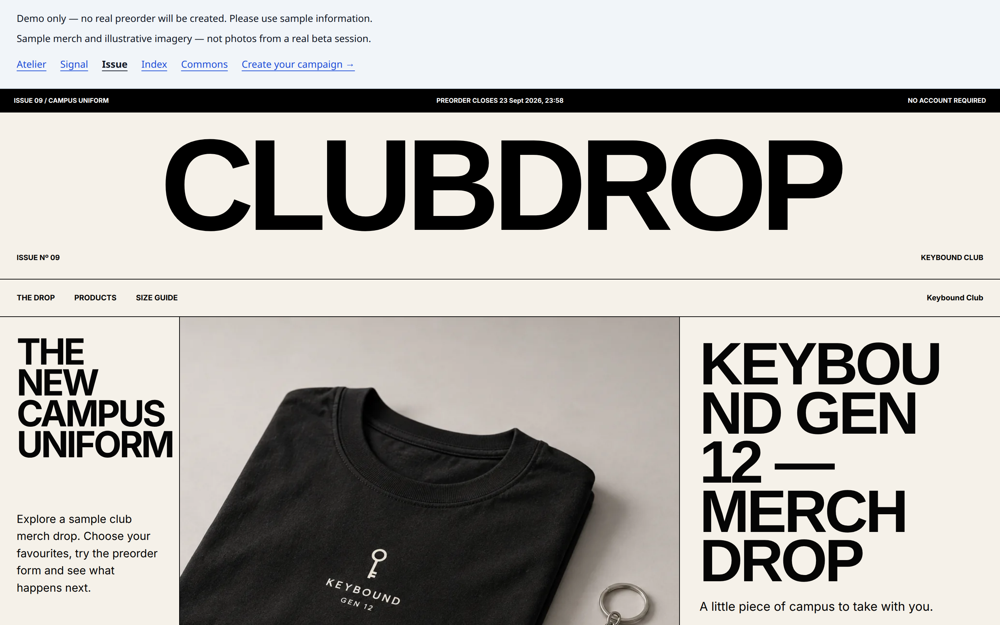
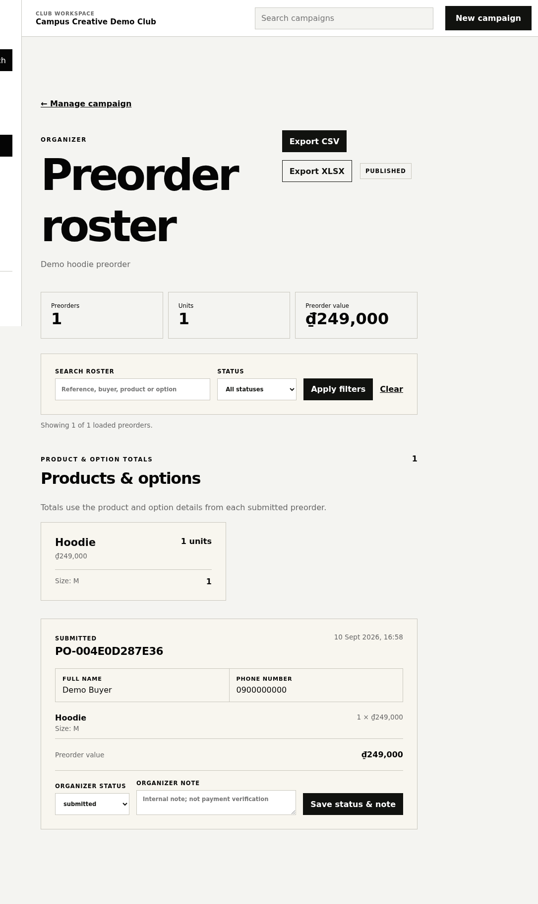

# Clubdrop

**AI-assisted merch preorder campaign builder for student clubs.**

Clubdrop replaces the familiar campus workflow of a social post, a Google Form, a spreadsheet, and repeated DMs with a cleaner campaign flow: organizers describe a drop, review structured details, publish a polished page, and manage incoming preorders from one workspace.

## What I built

The product uses a canonical campaign model and five fixed visual templates instead of generating websites from scratch. Buyers can open a shared campaign link and submit a preorder without creating an account. Organizers get a protected workspace for campaign setup, preview/publish controls, and preorder management.

The AI layer is deliberately constrained. It helps structure messy organizer notes into a candidate draft, but the organizer must review authoritative details such as price, deadline, payment instructions, and pickup information before saving. Public buyer pages do not depend on an LLM.

## Why I built it this way

The goal was not to recreate a full e-commerce platform. Student clubs usually need a lightweight campaign tool for occasional drops, not inventory, shipping, marketplace discovery, or platform-held payments. Fixed templates keep the output polished and predictable while the structured data model keeps buyer and organizer flows deterministic.

## Stack

React Router, React, TypeScript, Cloudflare Workers, Supabase, Zod, Dify, Vitest, and Playwright.

## Current status

Demo-ready on a development Worker. Product polish is complete and closed-beta preparation is in progress. This is not presented as a production launch or traction claim.

## Portfolio notes

The strongest story is the full workflow:

**messy organizer input → AI-assisted structuring → required human review → polished campaign page → organized preorder roster**

## Screenshots

Captured from the development Worker. Authenticated organizer screens use a synthetic club (`Campus Creative Demo Club`) and one synthetic preorder (`Demo Buyer` / `0900000000`); the organizer email was cropped out. These are development/demo frames, not a production-launch or traction claim.

### Required human review (core AI story)

The organizer must confirm authoritative details — price, deadline, payment, pickup, and confirmation — after a single AI structuring pass, before anything is saved.

### Organizer dashboard

Signed-in workspace after creating the synthetic demo club.

### Campaign editor

The authenticated editor for a reviewed draft, with the Issue template selected.

### Buyer campaign page

The Issue template — the strongest buyer-facing renderer — served from structured campaign data (no LLM on buyer routes).

### Preorder roster

The organizer roster with one synthetic preorder, product/option totals, status controls, and CSV/XLSX export.

