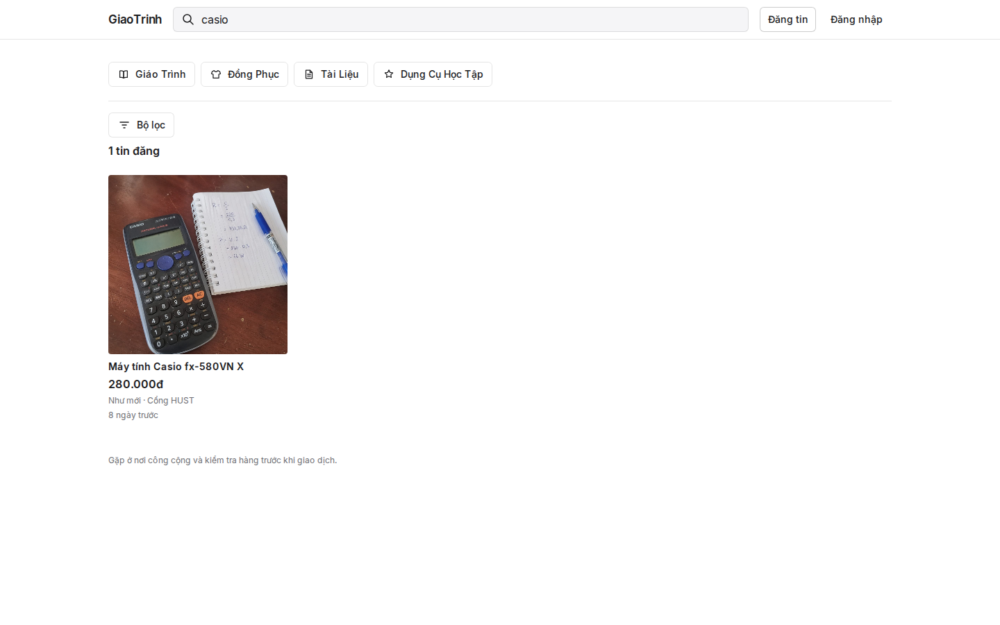
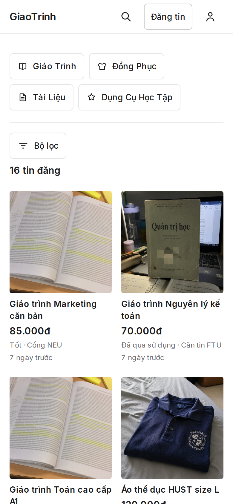

# GiaoTrinh — Case Study

## Overview

GiaoTrinh is a Vietnam-only student exchange for lawful textbooks, uniforms, and study supplies. Classmates can browse, search, and open an active listing without an account, then reveal the seller's current contact after an explicit safety step and meet in person. It is deliberately not a general marketplace and not a payment product — there is no checkout, escrow, shipping, commission, or in-app chat.

## Problem

Vietnamese students already trade used course materials through class group chats and social networks. Discovery is fragmented, Vietnamese search is unreliable, and contact details get copied into posts that leak, go stale, or disappear. GiaoTrinh keeps a small sale-only loop — list a physical study resource, find it by title/category/school, then meet in person.

## What I built

- Public marketplace: Home feed, accent-insensitive Vietnamese search, category chips, school/sort filters, cursor pagination, listing detail with gallery, and seller profile grid.
- Sale-only listing contract: four educational categories, four conditions, VND price, school (catalog or `Trường khác` fallback), meetup place, 1–5 private images, and a server-enforced 8-active-listing cap.
- Access model: email/password auth with `.edu.vn` domain-suffix eligibility for sellers (never a raw `edu` substring check), verification gate, and onboarding.
- Privacy boundary: contact lives at profile level and is never placed in feed/detail/profile/SEO payloads. It is revealed per listing through a separate no-store endpoint only after a safety acknowledgement.
- Default-deny mutations, ownership-aware private image proxy, HMAC-signed public image tokens, admin/report/audit surfaces, and scheduled Appwrite Functions for maintenance.

## Why I built it this way

The job is campus exchange of lawful physical materials, so payments, shipping, and chat are intentionally out of scope. Anonymous browse and contact match how classmates already behave, while `.edu.vn` verification gates only the act of selling. Keeping contact off public DTOs and revealing it per listing avoids the exact leak that plagues group-chat posts.

## Engineering highlight

When the public Home page was amplifying database reads (listing rows plus per-listing profile/school lookups plus a large school catalog), I cut it down without loosening any permission: a one-hour cache for the school catalog, batched profile/school projection, request-level dedupe of the detail load, and HMAC image tokens that authorize public images with zero database reads. A later Appwrite read-quota incident was handled as a data-access hardening problem and a preview-only demo fallback, not a permission shortcut.

## Stack

Next.js 16 (App Router + SSR), React, TypeScript, Zod, Vitest, and Appwrite (Sites, Auth, TablesDB, Storage, Functions), behind a GitHub Actions quality gate.

## Current status

Feature-complete and deployment-ready on `main`. Public production verification is pending an Appwrite database-read quota reset. This is not presented as a launched product, live-user, or traction claim.

## Screenshots

Captured from local fixture mode (`QA_FIXTURE_MODE`) with synthetic demo listings. Contact is never shown until the safety acknowledgement, and these frames stop at that step, so no seller contact is exposed.

### Search / discovery

Accent-aware search for `casio` — one matching listing with a real product photo (not a repeated fixture tile).

### Marketplace home

Browse grid with Vietnamese search, category chips, and filters.

### Listing detail

Casio listing — gallery, price, condition, school, meetup — with contact hidden behind `Liên hệ`.

### Contact safety step

The `Trước khi liên hệ` acknowledgement shown before any contact is revealed.

### Mobile

The 390px home layout, since most campus traffic is on a phone.

