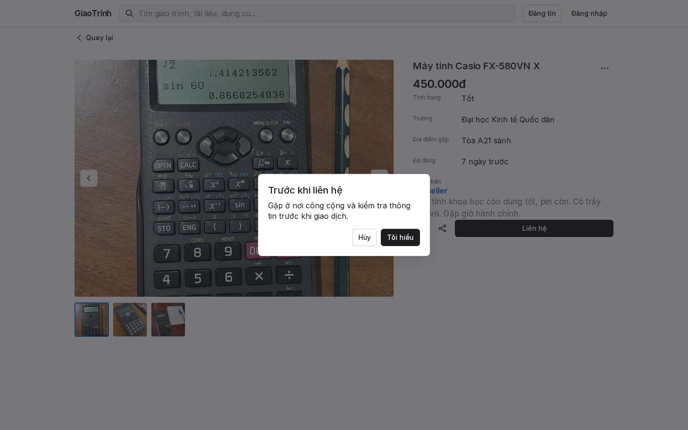

# GiaoTrinh

**In one line:** Vietnam campus exchange for textbooks and study supplies — browse without an account; contact only after an explicit safety step. No checkout, escrow, shipping, or chat.

## The decision that matters

Contact details **never** sit on public listing DTOs. They are revealed per listing, after a safety acknowledgement, through a no-store endpoint. That is the product fix for “phone number pasted into a group chat.”

## Problem

Students already trade materials in group chats. Discovery is fragmented, Vietnamese search is weak, and phone numbers in posts leak or go stale.

## What I built

- Public feed, accent-insensitive Vietnamese search, category/school filters, listing detail, seller profile
- Sale-only listings (categories, condition, VND, school, meetup, 1–5 images, 8-active cap)
- `.edu.vn` seller eligibility (domain-suffix check), verification gate
- Default-deny mutations, private image proxy, HMAC public image tokens

## Why this shape

In-person campus exchange of physical study materials — so payments and chat stay out. Anonymous browse matches real behavior; verification gates selling only.

## Engineering highlight

Home was amplifying DB reads (listings + per-row profile/school + school catalog). Hardened without loosening permissions: 1h school-catalog cache, batched profile/school projection, detail-load dedupe, HMAC image tokens with **zero DB reads**. An Appwrite read-quota incident was treated as data-access hardening + preview fallback — not a permission shortcut.

## Stack

Next.js 16 (App Router + SSR) · React · TypeScript · Zod · Vitest · Appwrite (Sites, Auth, TablesDB, Storage, Functions) · GitHub Actions quality gate

## Status

Feature-complete and deployment-ready on `main`. Public production verification pending an Appwrite DB-read quota reset. **Not** a launched / live-user / traction claim.

## Screenshots

Local fixture mode (`QA_FIXTURE_MODE`), synthetic listings. Frames stop before contact reveal.

1. **Search** — `casio` → real product photo  
2. **Listing detail** — gallery + meetup; contact still hidden  
3. **Safety step** — acknowledgement before any contact  
4. **Mobile** — 390px home
