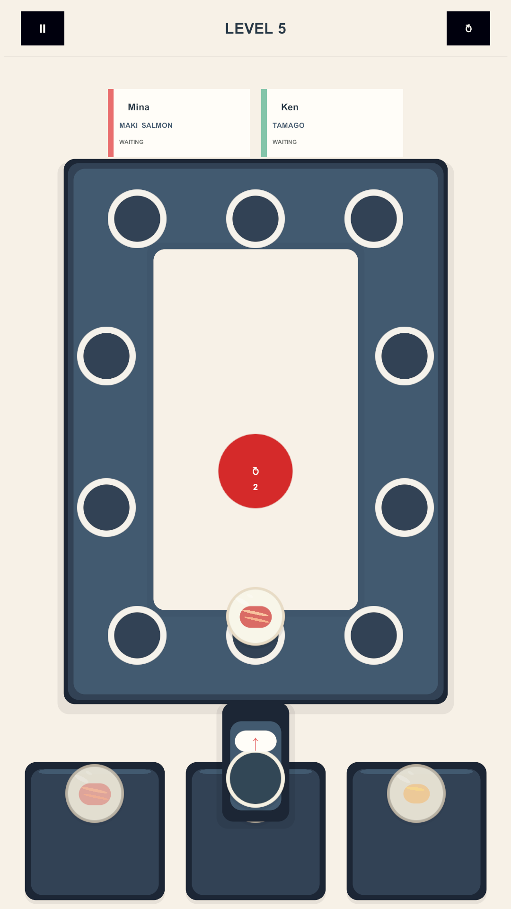

# SushiLoop

SushiLoop is a completed Unity 6 competition prototype: a portrait 2D puzzle game where players route sushi plates around a conveyor loop to satisfy customer orders.

The prototype includes a data-driven 20-level campaign, 15 stable sushi types, Level Select, saved progression, Win and Jam/Restart states, responsive portrait UI, and deterministic gameplay rules. It was developed with extensive AI-assisted workflows inside Unity, using shared source-of-truth documents, bounded agent tasks, Editor automation, testing, and visual review.

This folder is a public presentation layer only. The source repository remains private.

## Highlights

- Unity `6000.3.20f1`, 2D URP
- 20 authored levels
- 15 sushi types
- deterministic Entry / Rotate / serving loop
- saved progression and Level Select
- 32/32 current EditMode tests passed during the portfolio audit
- four main Unity scenes validated with no missing scripts or broken prefabs
- existing Windows build artifact documented
- AI-assisted implementation, debugging, testing, visual iteration, and Unity Editor workflow

## Portfolio status

**Portfolio ready with caveats.** The current PlayMode inventory contains 35 tests; the portfolio audit was interrupted by a locked Windows desktop after 4 tests had run without an observed failure, so the suite is not claimed as fully passing. No Android validation is claimed.

See [case-study.md](./case-study.md) for the concise public case study and the full curated screenshot set (main menu, level select, gameplay, win, and jam/restart).
