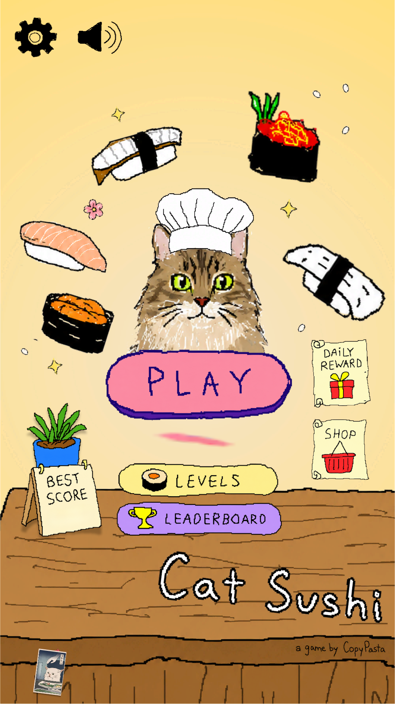
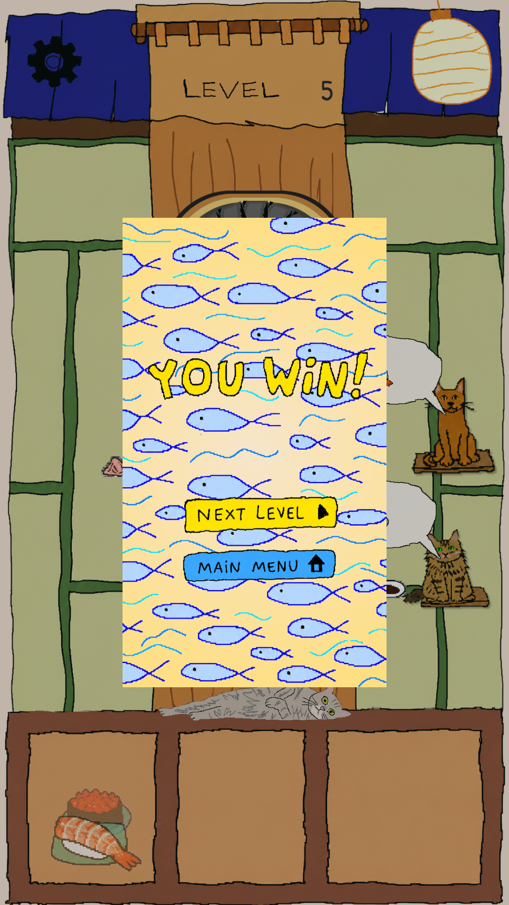

# SushiLoop

Completed Unity 6 competition prototype: portrait sushi-routing puzzle with hand-drawn runtime art, a 20-level campaign, and a structured AI-assisted workflow.

## Highlights

- Unity `6000.3.20f1`, 2D URP
- 20 authored levels · 15 sushi types
- Deterministic Entry / Rotate / serving loop
- Level Select + saved progression
- 32/32 EditMode tests in the portfolio audit
- Four main scenes validated (no missing scripts / broken prefabs)
- Windows build artifact documented

## Portfolio status

**Ready with caveats.** PlayMode suite not claimed fully passing (audit interrupted after 4/35). No Android validation claimed.

**Read:** [case-study.md](./case-study.md)
