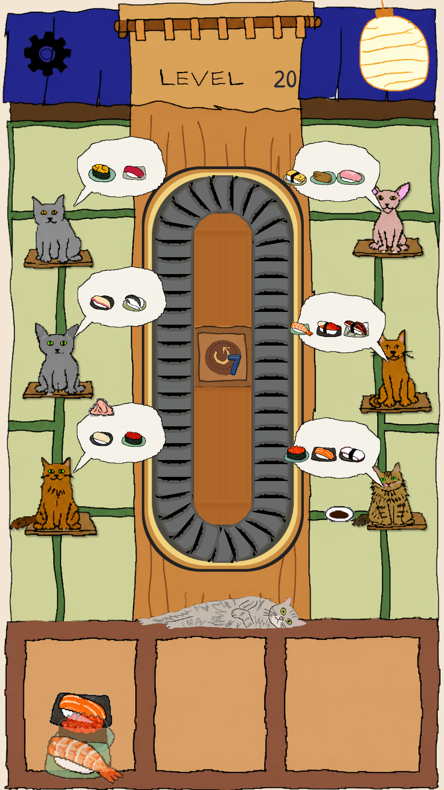
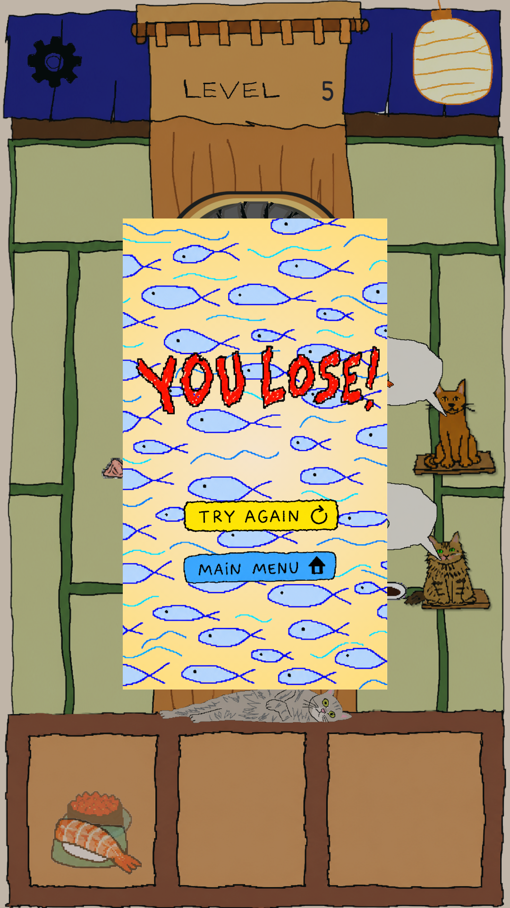

# SushiLoop

**In one line:** Portrait Unity 6 sushi-routing puzzle — hand-drawn runtime art, deterministic campaign loop, structured AI-assisted build (humans keep design authority).

## The decision that matters

Exact level inputs and gameplay constraints live in source-of-truth docs. Agents implement and iterate inside those bounds — they do not silently rebalance the game to make a solver or test pass.

## Overview

Completed competition prototype: route sushi plates from three queues around an eight-slot conveyor so customers get the right orders. Includes a 20-level campaign, 15 sushi types, Level Select, saved progression, Win/Jam states, and responsive portrait UI.

## What I worked on

I directed scope, gameplay loop, portrait UX, exact campaign data, and acceptance criteria. AI agents collaborated on bounded C# work, Unity Editor operations, test coverage, visual iteration, and evidence gathering — checked against source, scenes, tests, Console, and visual QC before acceptance.

## Verified portfolio snapshot

September 2026 audit:

- Unity `6000.3.20f1` inspected through the project Unity integration
- `Bootstrap`, `MainMenu`, `LevelSelect`, `Gameplay` in Build Settings — zero reported issues / missing scripts / broken prefabs
- EditMode suite **32/32** passed (0 failed, 0 skipped)
- Exactly **20 authored levels** and **15 stable sushi types** (code + SSOT + tests)
- Windows build artifact present and documented

PlayMode inventory has 35 tests; the audit reached 4/35 with no observed failure before a locked Windows desktop left Unity unfocused — so this case study does **not** claim the full PlayMode suite passed. No Android device validation claimed.

## Screenshots

Real 1080×1920 Game View captures from the hand-drawn runtime pass (verified source commit). Hero = **Level 5**.

**Main:** Main Menu → Level 5 → Win

**Also:** Level Select · Level 20 · Jam (supporting)

## Tech

Unity 6 · C# · URP 2D · data-driven level assets · uGUI / TextMeshPro · Unity Test Framework · Editor automation / MCP-assisted workflow

## CV bullets

- Built a deterministic portrait 2D sushi-routing puzzle in Unity 6 with a data-driven 20-level campaign, 15 sushi types, three queues, and an eight-slot conveyor loop.
- Validated Level Select, saved progression, Entry/Rotate routing, serving, Win, and Jam/Restart with focused EditMode and PlayMode coverage.
- Directed an AI-assisted Unity workflow across implementation, testing, Editor automation, and visual QC while keeping campaign data and acceptance criteria human-controlled.
