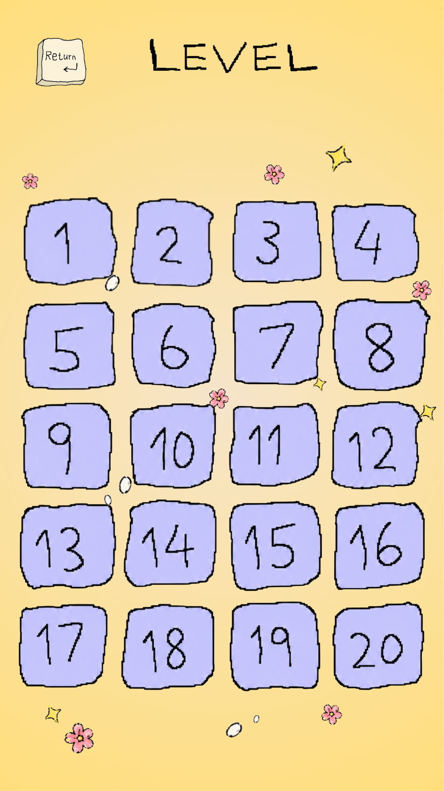
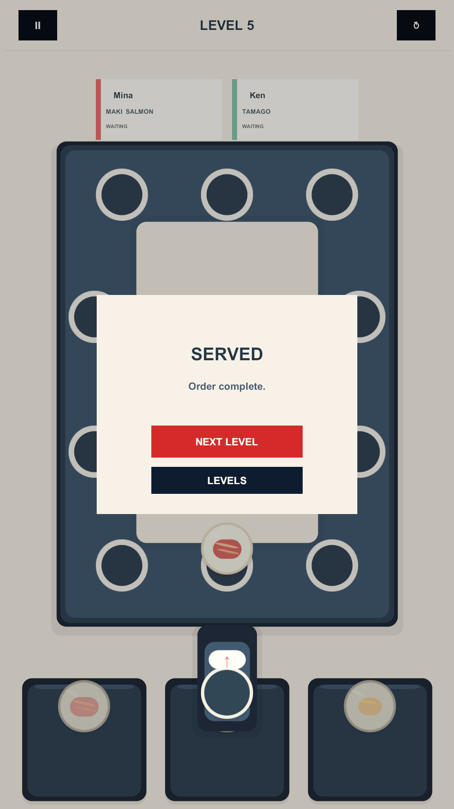
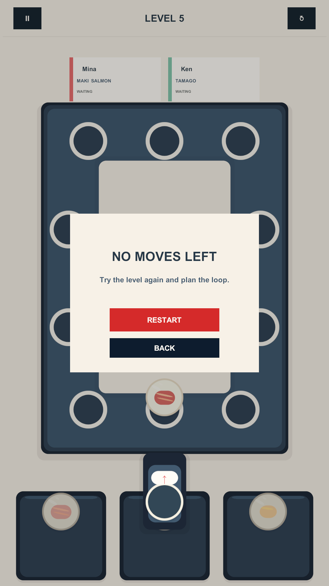

# SushiLoop

**In one line:** Portrait Unity 6 sushi-routing puzzle prototype — deterministic campaign loop, built with a structured AI-assisted workflow (humans keep design authority).

## Overview

Completed competition prototype: route sushi plates from three queues around an eight-slot conveyor so customers get the right orders. Includes a 20-level campaign, 15 sushi types, Level Select, saved progression, Win/Jam states, and responsive portrait UI.

## What I worked on

I directed the prototype scope, gameplay loop, portrait UX, exact campaign data, and acceptance criteria. AI agents were used extensively as implementation and review collaborators for bounded C# work, Unity Editor operations, test coverage, visual iteration, and evidence gathering.

The workflow was intentionally structured rather than prompt-to-code: shared source-of-truth documents defined the intended behavior, agents worked within narrow tasks, and changes were checked against source, Unity scenes, tests, Console state, and visual QC before acceptance.

## Why the AI workflow matters

The project separates design authority from implementation assistance. Exact level inputs and gameplay constraints were locked in project documentation so an agent could not silently rebalance the game to make a solver or test pass. Runtime presentation and deterministic gameplay contracts were kept distinct, making key states testable outside animation timing and scene layout.

This made AI useful for iteration without letting the model become the source of truth for the game.

## Verified portfolio snapshot

During the September 2026 portfolio audit:

- Unity `6000.3.20f1` was inspected through the project Unity integration.
- `Bootstrap`, `MainMenu`, `LevelSelect`, and `Gameplay` were all present in Build Settings and validated with zero reported issues, missing scripts, or broken prefabs.
- The current EditMode suite passed **32/32** tests with 0 failed and 0 skipped.
- The project was verified as containing exactly **20 authored levels** and **15 stable sushi types** through code, SSOT documentation, and tests.
- An existing Windows build artifact was present and documented.

The current PlayMode inventory contains 35 tests. The audit run reached 4/35 without an observed failure before a locked Windows desktop left Unity unfocused, so this case study does **not** claim that the full current PlayMode suite passed. Android device validation is also not claimed.

## Screenshots

Portrait 1080×1920 frames from the current clean 2D foundation pass, drawn from the project's QC captures. The hero frame is the core gameplay screen.

### Gameplay (hero)

Conveyor loop, three queues, the active customer/order, and Rotate state.

### Main menu

### Level select

Data-driven 20-level campaign progression.

### Win result

Win/result popup with progression affordances.

### Jam / restart

The no-moves failure state with a restart path.

## Tech

Unity 6 · C# · URP 2D · data-driven level assets · uGUI / TextMeshPro · Unity Test Framework · Unity Editor automation / MCP-assisted workflow

## Short portfolio copy

SushiLoop is a portrait-first Unity puzzle prototype with a deterministic sushi-routing loop, a 20-level campaign, saved progression, and explicit Win/Jam states. The project also explores structured AI-assisted game development: agents helped implement, test, inspect, and iterate inside a workflow governed by source-of-truth documents and Unity validation rather than free-form generation.

## CV bullets

- Built a deterministic portrait 2D sushi-routing puzzle prototype in Unity 6 with a data-driven 20-level campaign, 15 sushi types, three queues, and an eight-slot conveyor loop.
- Implemented and validated Level Select, saved progression, Entry/Rotate routing, serving, Win, and Jam/Restart behavior with focused EditMode and PlayMode coverage.
- Directed an AI-assisted Unity workflow across implementation, testing, Editor automation, and visual QC while keeping exact campaign data and acceptance criteria human-controlled.
